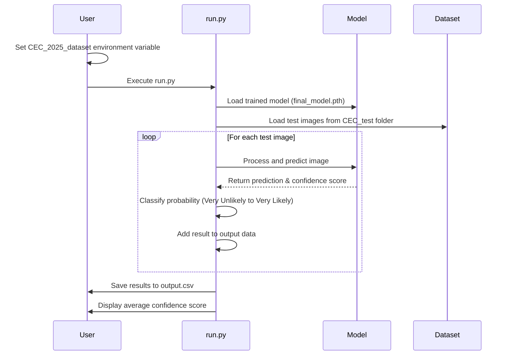

# Tumor Detection Model

This project is a deep learning-based tumor detection system using PyTorch and EfficientNetV2. It trains a model to classify brain MRI images as either containing a tumor ("yes") or not ("no").

## Prerequisites

Before running this project, you need to have the following installed:

- Works on Macbook Sequoia 15.3.2 using an Intel Core i5, and Windows Machine with Intel Core i7

- Python 3.9.21 or 3.11.3
- PyTorch 2.1.0
- torchvision 0.16.0
- Pillow 10.0.0
- numpy 1.24.0
- Other dependencies listed in requirements.txt

You can install the required packages using pip:

```bash
pip install -r requirements.txt
```

## Environment Setup

This project requires setting an environment variable to locate your dataset:

```bash
# Windows (Command Prompt)
set CEC_2025_dataset=path\to\your\dataset

# Windows (PowerShell)
$env:CEC_2025_dataset = "C:\full\path\to\your\dataset"

# macOS/Linux
export CEC_2025_dataset=/path/to/your/dataset
```

Important Notes:
1. Use the FULL path to your dataset directory
2. The path should point to the parent directory containing the `yes`, `no`, and `CEC_test` folders
3. In PowerShell, the environment variable will only persist for the current session

The script will use this environment variable to find your dataset directory.

## Dataset Structure

The dataset should be organized as follows:

```
CEC_2025_dataset/
└── CEC_2025/
    ├── yes/
    │   ├── yes__001.png
    │   ├── yes__002.png
    │   └── ...
    ├── no/
    │   ├── no__001.png
    │   ├── no__002.png
    │   └── ...
    └── CEC_test/
        └── test_001.png
        └── test_002.png
        └── ...
```

- The `yes` folder contains MRI images with tumors
- The `no` folder contains MRI images without tumors
- The `CEC_test` folder contains test images for prediction

## Workflow Sequence Diagram

The following sequence diagram illustrates the workflow of the tumor detection system:


## Setting up the Environment for the Model

1. Clone the repository to your local machine.

2. Open a command terminal and navigate to the `python` folder.

3. Install the required dependencies by running:
   ```bash
   pip install -r requirements.txt
   ```

4. You can now start training the model by running:
   ```bash
   python train.py
   ```

   Alternatively, to run the test script, execute:
   ```bash
   python run.py
   ```
## Running the Model

To run the model on the CEC_test dataset (after setting environment var.):

```bash
python run.py
```

The run script will:
1. Load the trained model from `final_model.pth` file
2. Process all images in the `CEC_test` folder
3. Generate predictions with confidence scores
4. Save results to `output.csv` in same directory as script

## Additional Scripts

<details>
<summary><b>Testing the Model (test.py)</b></summary>

To test the model's performance on the CEC_test dataset:

```bash
python test.py
```

The test script will:
1. Load the trained model from `final_model.pth` file
2. Process all images in the `CEC_test` folder
3. Generate predictions with confidence scores
4. Save results to `output.csv`

You can modify `NUM_IMAGES` in `test.py` to change the number of test images (default: 50).
</details>

<details>
<summary><b>Training the Model (train.py)</b></summary>

To train the model, run:

```bash
python train.py
```

The training script will:
1. Load and preprocess the images from the `yes` and `no` folders
2. Train an EfficientNetV2 model on these images
3. Save the trained model as `tumor_model_1000.pth`

You can modify the following parameters in `train.py`:
- `NUM_IMAGES`: Number of images to use for training
- `MODEL_NAME`: Name of the saved model file
- `epochs`: Number of training epochs
</details>

## Understanding the Results

After running the script, you will see:
- A CSV file (`output.csv`) containing:
  - File name
  - Prediction (Yes/No)
  - Confidence score (0-1)
  - Probability classification (Very Unlikely, Unlikely, Likely, Very Likely)
- Average confidence score across all tested images
- Total number of images tested

The confidence score interpretation:
- < 0.5: Very Unlikely
- 0.5-0.75: Unlikely
- 0.75-0.9: Likely
- > 0.9: Very Likely

## Troubleshooting

## Virtual Environment Setup

It's recommended to use a virtual environment to avoid package conflicts. Here's how to set it up:

1. Create a new virtual environment:
```bash
# Windows
python -m venv venv

# macOS/Linux
python3 -m venv venv
```

2. Activate the virtual environment:
```bash
# Windows (Command Prompt)
venv\Scripts\activate.bat

# Windows (PowerShell)
venv\Scripts\Activate.ps1

# macOS/Linux
source venv/bin/activate
```

3. Install the required packages:
```bash
pip install -r requirements.txt
```

4. When you're done, you can deactivate the virtual environment:
```bash
deactivate
```

### PyTorch Installation Issues

If you encounter PyTorch compatibility issues, make sure you have Python 3.9 and PyTorch 2.1.0 installed. For newer Python versions, you may need to use the latest pre-release version of PyTorch:

```bash
pip install --pre torch torchvision torchaudio
```

### Dataset Issues

If the scripts cannot find the dataset, verify that:
1. The environment variable `CEC_2025_dataset` is correctly set
2. Your folder structure matches the one described above
3. The images in the CEC_test folder are in a supported format (png, jpg, jpeg) 
